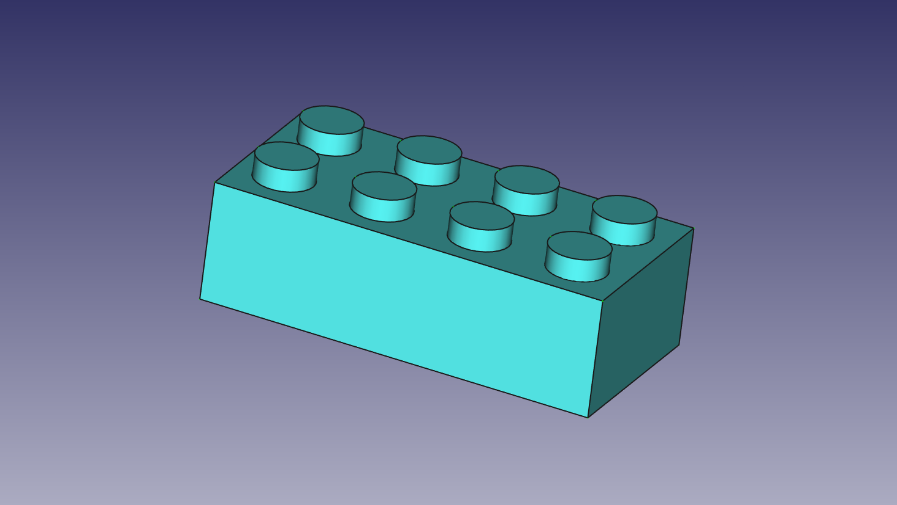
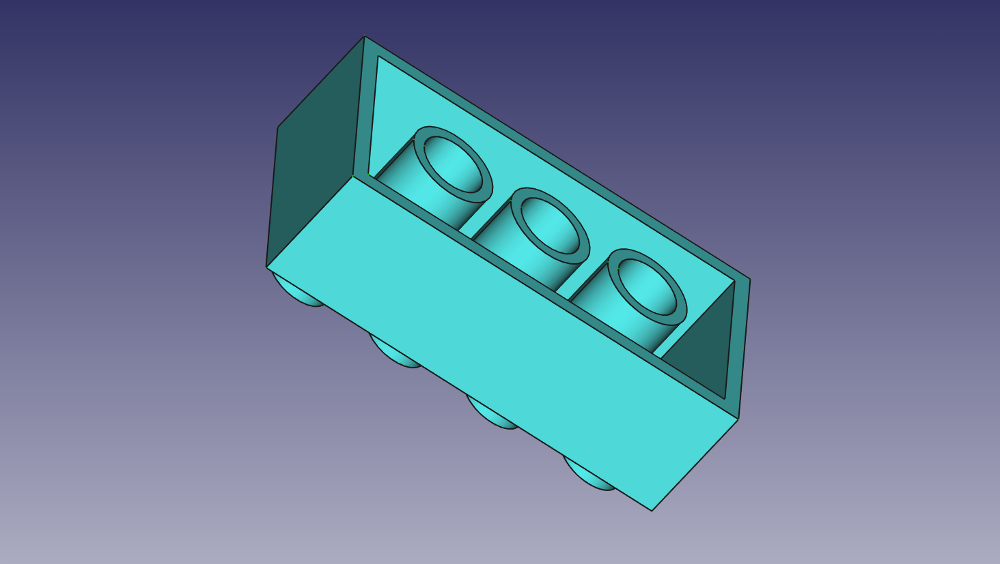

# Model samples & exercises developed using FreeCAD.

## 1. DHT22+nodeMCU **IOT Node + Sensor temperature**.

## 2. Exercise 001: Designing a **LEGO piece**.

## Install FreeCAD [here](https://www.freecadweb.org/)

### Kike Ramírez // 13.08.2018 