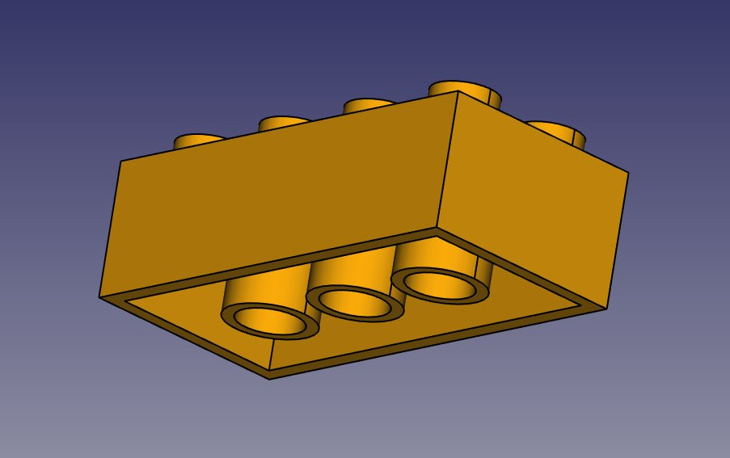

# Model samples & exercises developed using FreeCAD.

1. DTT22+ESP8266 IOT Node + Sensor temperature.
2. Exercise 001: Designing a LEGO piece.

## Install FreeCAD [here](https://www.freecadweb.org/). 

### Kike Ramírez // 13.08.2018 